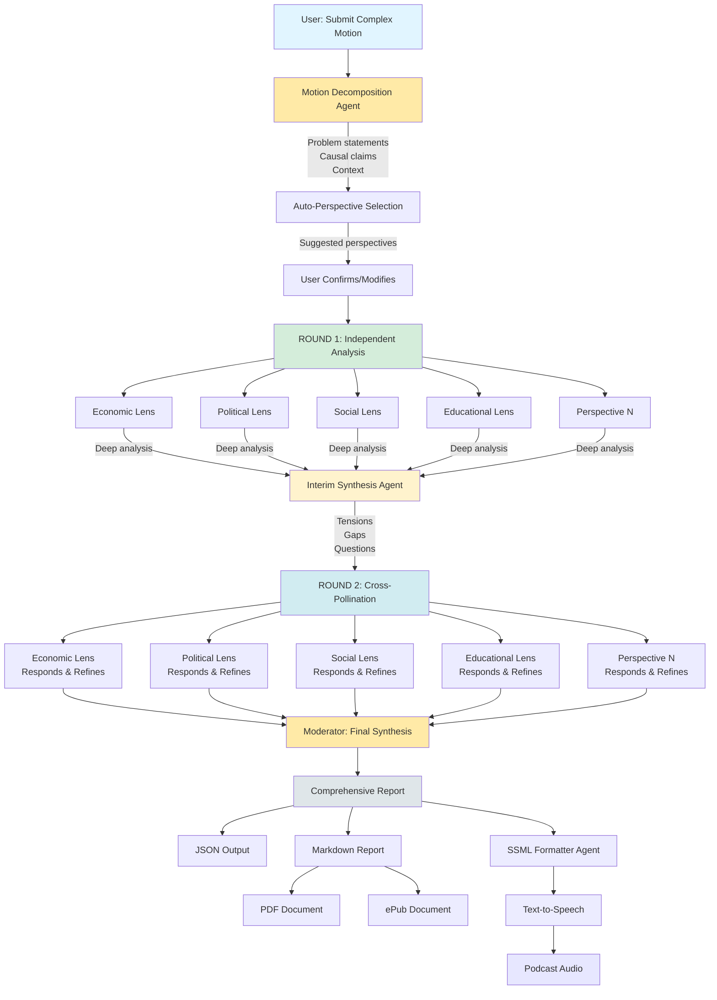
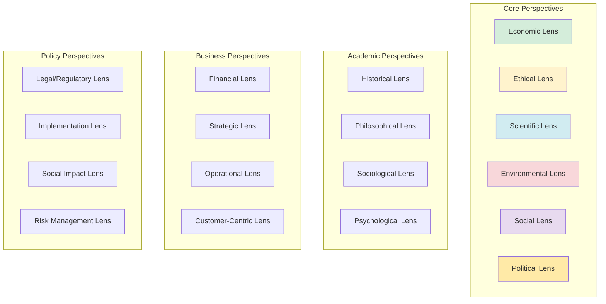
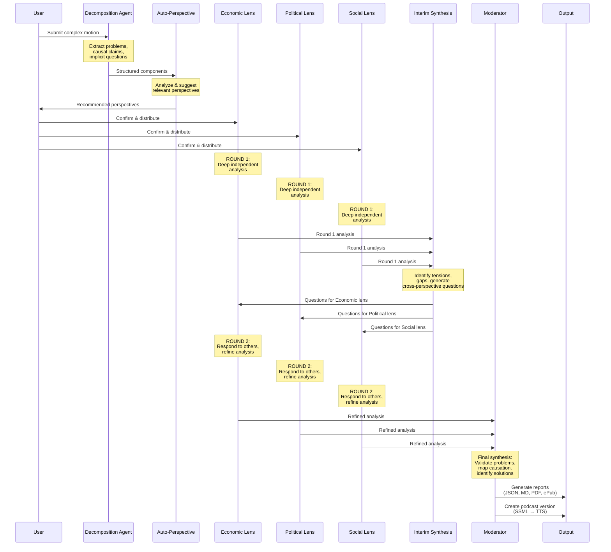

# Panel Of Claudes: Multi-Perspective AI Panel System


[](https://github.com/danielrosehill/Claude-Code-Repos-Index)
[](https://github.com/danielrosehill/Github-Master-Index)

**Use Cases:** Multi-Perspective Analysis | Idea Exploration | Critical Thinking | Research Synthesis | Decision Support

## Overview

Panel Of Claudes is an experimental multi-agent AI system that simulates expert panel discussions where multiple agents analyze topics through different analytical lenses. Rather than adversarial debate, the system creates a think tank environment where diverse perspectives illuminate different dimensions of complex topics.

Think of it as assembling a panel of domain experts—an economist, ethicist, scientist, and policy analyst—each bringing their unique framework to bear on the same question. The result isn't about "winning" an argument, but rather achieving a richer, multi-dimensional understanding.

### Why This Matters

- **Multi-Lens Analysis**: Topics explored through complementary frameworks (economic, ethical, scientific, etc.)
- **Beyond Binary Thinking**: Escapes for/against limitations to reveal nuanced dimensions
- **Expert Panel Simulation**: Mimics real-world research symposiums and policy roundtables
- **Productive Tensions**: Identifies where perspectives conflict and where they align
- **Comprehensive Synthesis**: A moderator weaves perspectives into actionable insights
- **Multi-Format Output**: From machine-readable JSON to podcast-ready audio narratives

### From Debate to Multi-Perspective Analysis

Traditional debate formats (pro vs. con) force complex topics into binary frames. Real-world decision-making rarely works this way. Instead, we need to understand:
- How different stakeholders view the issue
- What trade-offs exist between competing values
- Where unexpected synergies might emerge
- Which dimensions of a problem we hadn't considered

This system embraces that complexity by letting multiple perspectives coexist, interact, and inform each other.

## System Architecture



## Perspective Lens Library



## How It Works

### Panel Configuration Modes

**1. Fixed Perspectives Mode**
- User selects 3-7 specific lenses from the perspective library
- Best for targeted analysis of known dimensions

**2. Auto-Perspective Mode**
- System analyzes the topic and selects relevant perspectives
- Best for exploratory analysis

**3. Custom Perspectives Mode**
- User defines their own analytical frameworks
- Best for specialized domains or unique analytical needs

### Sequential Flow



### Phase 0: Motion Decomposition

**Input**: Complex motion or problem statement from user

**Process**: Decomposition agent analyzes the motion and extracts:

```yaml
problem_statements:
  - Core issues identified in the motion
  - Quantifiable concerns
  - Observed patterns

causal_claims:
  - "X leads to Y" statements
  - Proposed mechanisms
  - Feedback loops identified

implicit_questions:
  - What questions is this motion really asking?
  - What decisions need to be made?
  - What trade-offs exist?

context:
  - Geographic/cultural setting
  - Relevant domains
  - Stakeholder groups
  - Historical background
```

**Output**: Structured motion components that become inputs for perspective agents

### Phase 1: Auto-Perspective Recommendation

**Input**: Decomposed motion components

**Process**: System analyzes motion structure and suggests:

```yaml
required_perspectives:
  - Perspectives essential for this specific motion
  - Based on domains identified in context

recommended_perspectives:
  - Perspectives that would add significant value
  - Optional but suggested

optional_perspectives:
  - Additional lenses that could provide insight
  - User can add if interested
```

**User Action**: Confirms, modifies, or manually selects perspectives

**Output**: Finalized perspective configuration (typically 3-7 lenses)

### Phase 2: Round 1 - Independent Deep Analysis

Each perspective agent receives structured instructions:

**Mission**: Comprehensive understanding through your analytical lens

**Input Provided to Each Agent**:
- Decomposed motion (problems, causal claims, questions, context)
- Their specific analytical framework
- Structured analysis template

**Analysis Framework for Each Perspective**:

1. **Problem Validation**
   - Which problem statements are valid through your lens?
   - What evidence supports/contradicts them?
   - What problems are missing?

2. **Causal Analysis**
   - Evaluate each causal claim
   - Identify alternative explanations
   - Map feedback loops and systemic effects

3. **Trade-offs & Tensions**
   - What values/priorities conflict?
   - What are opportunity costs?
   - What second-order effects matter?

4. **Solution Spaces**
   - What interventions does your lens suggest?
   - Implementation challenges?
   - Success metrics?

5. **Lens Limitations**
   - What can your lens NOT address?
   - Where do you need other perspectives?
   - What uncertainties remain?

**Output**: Each perspective produces comprehensive independent analysis

### Phase 3: Interim Synthesis - Identifying Productive Tensions

**Input**: All Round 1 analyses

**Process**: Interim synthesis agent identifies:

```yaml
convergent_themes:
  - Where perspectives agree
  - Confirmed problems across lenses
  - Aligned causal mechanisms

productive_tensions:
  - Where perspectives constructively disagree
  - Competing frameworks
  - Different value priorities
  - Questions that emerge from tensions

knowledge_gaps:
  - What hasn't been addressed
  - Empirical questions raised
  - Missing perspectives

cross_perspective_questions:
  - Specific questions for each lens based on others' analyses
  - Clarifications needed
  - Opportunities for refinement
```

**Output**:
- Summary of convergences and tensions
- Specific questions for each perspective to address in Round 2

### Phase 4: Round 2 - Cross-Pollination & Refinement

**Input to Each Perspective**:
- Their own Round 1 analysis
- Summary of other perspectives' analyses
- Tensions involving their perspective
- Specific questions directed at them

**Instructions**:
1. Respond to questions directed at your lens
2. Acknowledge valid points from other perspectives
3. Clarify where others misunderstand your framework
4. Refine your analysis based on cross-perspective insights
5. Identify where perspectives complement each other

**Output**: Each perspective produces refined analysis that:
- Responds to other perspectives
- Refines original analysis
- Acknowledges complementary insights
- Maintains analytical framework integrity

### Phase 5: Final Moderation & Synthesis

**Input**:
- Round 1 independent analyses
- Interim synthesis
- Round 2 refined analyses

**Process**: Moderator creates comprehensive synthesis structured as:

1. **Executive Summary**
   - Multi-paragraph overview of key findings

2. **Problem Validation Across Perspectives**
   - Strongly confirmed problems
   - Nuanced/contested issues
   - Newly identified problems

3. **Causal Analysis**
   - Competing explanations mapped
   - Feedback loops identified
   - Multi-perspective causal models

4. **Productive Tensions**
   - Value conflicts between perspectives
   - Trade-offs identified
   - Resolution spaces explored

5. **Solution Spaces**
   - Where perspectives converge on solutions
   - Complementary approaches
   - Implementation considerations

6. **Knowledge Gaps**
   - Empirical questions remaining
   - Normative questions identified
   - Areas needing further analysis

7. **Implications for Action**
   - Scenario-based recommendations
   - Integrated approaches
   - Decision frameworks

**Output**: Comprehensive multi-perspective report

## Output Formats

### Machine-Readable
- **JSON**: Structured data for integration with other systems
  - Topic metadata
  - Selected perspectives and their frameworks
  - Individual perspective analyses
  - Cross-perspective insights and tensions
  - Timestamps and flow

### Human-Readable Documents
- **Markdown**: Clean, formatted panel proceedings with perspective-by-perspective analysis
- **PDF**: Print-ready multi-perspective report
- **ePub**: E-reader friendly format for in-depth reading

### Audio Content
- **SSML Formatting**: Panel discussion formatted with podcast host personality
- **TTS Audio**: Text-to-speech narration of the full multi-perspective analysis
- **Podcast**: Ready-to-listen "think tank" style audio content

## Implementation Options

### Quick Start (Claude Code)
Use Claude Code with custom agents to implement a miniature version:
- Define agent prompts
- Chain agent interactions
- Generate outputs

### Full Implementation (Multi-Agent Frameworks)
Leverage frameworks like CrewAI, AutoGen, or LangGraph:
- Code-defined agent behaviors
- Persistent state management
- Advanced orchestration
- Custom output pipelines

## Example: Israeli Socio-Economic Analysis

**Motion Submitted**:
> "The State of Israel suffers from ongoing cost of living problems and severe income inequality. The transition from socialist economy to high-tech powerhouse created a binary economy where high-tech workers thrive while others struggle with wages that don't match living costs. The education system focuses on STEM to feed this single sector. Meanwhile, the political system prioritizes security over domestic concerns and lacks geographic accountability, as the concept of constituency representation is foreign to Israel."

### Phase 0: Motion Decomposition

**Problem Statements Extracted**:
- High cost of living relative to wages
- Severe income inequality (among world's highest)
- Economic over-dependence on high-tech sector
- Binary/tiered economic structure
- Political system lacks geographic accountability
- Security concerns eclipse domestic policy priorities
- Education system over-indexed on STEM

**Causal Claims Identified**:
- High-tech economic focus → income inequality
- Single-sector dominance → binary economy
- STEM education focus → workforce pipeline for one sector
- Political structure without geographic mandate → accountability deficit
- Security prioritization → neglect of cost-of-living issues

**Implicit Questions**:
- Is economic diversification desirable and achievable?
- Would geographic constituency system improve accountability?
- How should education balance economic utility vs. broader development?
- Can domestic priorities coexist with security needs?

### Phase 1: Auto-Perspective Recommendation

**Required Perspectives**:
- Economic Lens (inequality, high-tech dominance)
- Political Lens (governance structure, accountability)
- Social Lens (cost of living, class divisions)

**Recommended Perspectives**:
- Educational Lens (STEM focus, workforce development)
- Geopolitical Lens (security vs. domestic priorities)

**Optional Perspectives**:
- Historical Lens (socialist → capitalist transition)
- Philosophical Lens (meritocracy vs. equity values)

**User Selects**: Economic, Political, Social, Educational, Geopolitical

### Phase 2: Round 1 - Sample Independent Analysis

**Economic Lens (excerpts)**:
- ✅ Confirms income inequality is severe (Gini coefficient data)
- ✅ Confirms over-indexing on single sector (concentration risk)
- ⚠️ Challenges "binary" framing—sees multi-tiered economy
- **Causal analysis**: High-tech creates wage ceiling; floor set by policy, housing, education access
- **Solution space**: Economic diversification incentives, progressive taxation, housing supply interventions

**Political Lens (excerpts)**:
- ✅ Confirms accountability deficit in current system
- **Causal analysis**: List-based proportional representation → parties accountable to party leadership, not citizens
- **Geographic constituencies**: Could create local accountability for housing, cost-of-living issues
- ⚠️ Trade-off: Might weaken national consensus on security policy

**Social Lens (excerpts)**:
- ✅ Confirms binary experience ("high-tech vs. everyone else")
- **New problem identified**: Social cohesion degradation, class resentment
- **Causal analysis**: Economic inequality → residential segregation → reduced social mixing
- **Limitation**: Cannot evaluate technical economic mechanisms

### Phase 3: Interim Synthesis

**Convergent Themes**:
- All perspectives confirm inequality problem
- Economic, Social, Educational lenses identify self-reinforcing cycles
- Multiple perspectives see housing as critical variable

**Productive Tensions**:
1. **Economic vs. Political**: Is inequality economic inevitability or policy failure?
2. **Educational vs. Economic**: Should education serve economy or human development?
3. **Geopolitical vs. Social**: How to balance security spending with domestic investment?

**Questions for Round 2**:
- To Economic: If political structure changed, would economic outcomes change?
- To Political: Do other countries with geographic constituencies show better outcomes?
- To Geopolitical: Does inequality itself pose security risks?

### Phase 4: Round 2 - Sample Refined Analysis

**Economic Lens Response**:
- Acknowledges Political lens point: Market outcomes aren't natural laws—they respond to institutional frameworks
- Refinement: Round 1 understated role of policy choices
- Responds to Geopolitical: Can model security-inequality feedback loop

**Political Lens Response**:
- Responds to empirical question: Points to constituency systems in comparable democracies
- Acknowledges Economic lens: Geographic reform alone won't solve inequality—needs complementary policies
- Clarifies to Geopolitical: Local accountability doesn't preclude national security consensus

### Phase 5: Final Synthesis (Excerpt)

**Problem Validation**:
- **Strongly Confirmed**: Income inequality (all lenses), cost of living crisis (Economic, Social), accountability deficit (Political, Social)
- **Nuanced**: "Binary economy" framing—Economic sees multi-tier structure; Social sees binary lived experience

**Causal Analysis - High-Tech Dominance → Inequality**:
- Economic: Market-rational outcome given incentive structures
- Political: Policy choice to favor sector through tax breaks, R&D investment
- Educational: Education system responds to labor market signals
- **Synthesis**: Self-reinforcing cycle where all three factors interact via feedback loops

**Productive Tension - Economic Efficiency vs. Social Equity**:
- Economic perspective values growth, innovation, global competitiveness
- Social perspective values equality, quality of life, social cohesion
- Tension point: High-tech success drives GDP growth BUT increases inequality
- **Resolution space**: Progressive redistribution + social investment funded by growth

**Solution Convergence - Economic Diversification**:
- Economic: Tax incentives for other sectors, R&D support
- Political: Regional development tied to constituency interests
- Educational: Broader curricula creating versatile workforce
- **Integrated approach**: All mechanisms could work together

**Knowledge Gaps**:
- Empirical: Have geographic constituencies in similar countries improved outcomes?
- Normative: What is proper role of education—economic utility or human development?
- Practical: What is citizen appetite for economic vs. security prioritization?

## Future Enhancements

### Perspective Persona Specialization
- Perspectives adopt specific schools of thought (e.g., "Keynesian Economic Lens" vs "Austrian Economic Lens")
- Historical figure perspectives (e.g., "What would Carl Sagan's perspective be?")
- Domain expert simulation for specialized topics

### Multi-Panel Conferences
- Chain multiple panels together with different perspective sets
- Output from one panel feeds into another (e.g., high-level analysis → implementation perspectives)
- Simulate multi-day academic conference structures
- Progressive refinement through iterative panels

### Interactive Perspective Selection
- AI-assisted perspective recommendation based on topic analysis
- User can add/remove perspectives mid-analysis
- Dynamic perspective weighting based on topic priorities
- Community-contributed custom perspective frameworks

### Live Interaction
- Stream perspective analyses in real-time
- Avatar visualization for each perspective agent
- Interactive audience participation and questions
- Live moderator synthesis as perspectives develop

## Use Cases

1. **Strategic Decision Making**: Evaluate complex decisions through multiple analytical frameworks
2. **Policy Analysis**: Understand multi-dimensional implications of policy proposals
3. **Research Synthesis**: Explore academic topics from complementary disciplinary perspectives
4. **Content Creation**: Generate nuanced, multi-perspective content for publications
5. **Education**: Teach multi-dimensional thinking and analytical framework application
6. **Due Diligence**: Comprehensive analysis of business opportunities, investments, or initiatives
7. **Ethics Committees**: Simulate multi-stakeholder perspectives for ethical deliberation
8. **Innovation Workshops**: Explore ideas through diverse lenses to identify opportunities and risks

## Getting Started

1. Clone this repository
2. Review the perspective lens library in `/perspectives`
3. Configure your preferred multi-agent framework (CrewAI, AutoGen, LangGraph)
4. Select your perspectives for analysis:
   ```bash
   python main.py --topic "Your topic here" --perspectives economic,ethical,scientific
   ```
   Or use auto-mode:
   ```bash
   python main.py --topic "Your topic here" --auto-perspectives
   ```
5. Review multi-perspective outputs in `/output`

## Technical Stack

- **Language**: Python
- **Framework**: CrewAI / AutoGen (configurable)
- **Output Generation**:
  - Markdown: Python-Markdown
  - PDF: WeasyPrint / ReportLab
  - ePub: ebooklib
  - TTS: Google TTS / Azure Speech / ElevenLabs

## Contributing

Contributions welcome! Areas of interest:
- Additional output formats
- Enhanced agent personalities
- Integration with research databases
- UI/UX improvements

## License

MIT License - See LICENSE file for details

## Author

**Daniel Rosehill**
Technology Communications Specialist | Automation Expert
[danielrosehill.com](https://danielrosehill.com)

To view an index of my Claude Code related projects, [click here](https://github.com/danielrosehill/Claude-Code-Repos-Index)

---

*"We don't see things as they are, we see them as we are." - Anaïs Nin*

*Panel Of Claudes helps us see things as they could be—through many lenses at once.*
